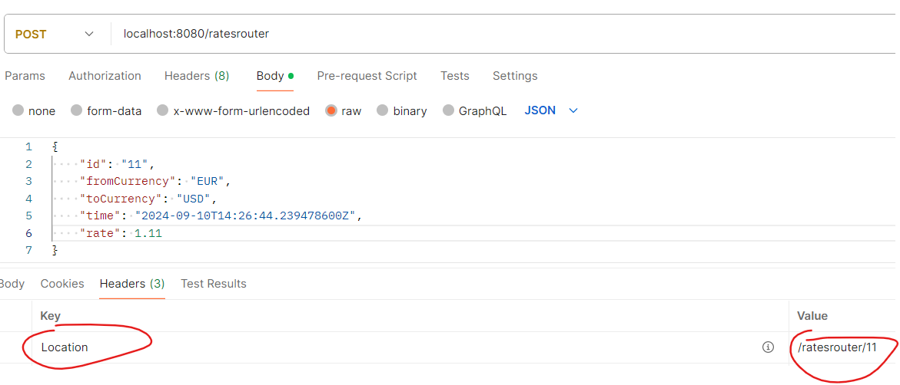

# Instructions:

### Using JDK 17

#### webfluxservice app
1. Run it locally on port 9001 - this microservice generates exchangeRates

---------------------

#### webflux-client app
2. Then initialize the MongoDB via the `./local/docker-compose.yaml` file in Docker
3. Run the webflux-client app locally on port 8080 - the ExchangeRateInit will call the reactive web client which will call our webfluxservice app on port 9001 - some records will be saved in the db
4. The webflux-client app is made both with rest controller approach and with router+handler approach
4. You can run Postman and execute:
*    GET on localhost:8080/ratescontroller
*    GET on localhost:8080/ratesrouter
--------------
*    GET localhost:8080/ratescontroller/1
*    GET localhost:8080/ratesrouter/1
--------------
*    POST localhost:8080/ratescontroller
*    POST localhost:8080/ratesrouter
*    with body:
`{
"id": "11",
"fromCurrency": "EUR",
"toCurrency": "USD",
"time": "2024-09-10T14:26:44.239478600Z",
"rate": 1.55
}`
* when using the ratesrouter, we also have the location header:

--------------
*    PATCH localhost:8080/ratescontroller/11
*    PATCH localhost:8080/ratesrouter/11
*    with body:
`{
"id": "11",
"fromCurrency": "EUR",
"toCurrency": "USD",
"time": "2024-09-10T14:26:44.239478600Z",
"rate": 1.66
}`
--------------
*    DELETE localhost:8080/ratescontroller/11
*    DELETE localhost:8080/ratesrouter/11

You can also see the MongoDB database data via Studio 3T or via IntelliJ db plugin.